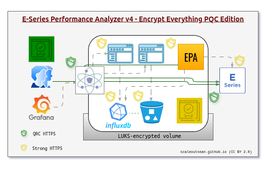

# README

- [README](#readme)
  - [E-Series SANtricity Collector (ESC) aka E-Series Performance Analyzer 4](#e-series-santricity-collector-esc-aka-e-series-performance-analyzer-4)
  - [ESC vs. EPA 3](#esc-vs-epa-3)
  - [Features](#features)
  - [Security](#security)
  - [AI](#ai)
  - [Minimum requirements](#minimum-requirements)
  - [Quick start](#quick-start)
    - [CLI](#cli)
    - [Docker and other container environments](#docker-and-other-container-environments)
  - [Database measurements ("tables")](#database-measurements-tables)
  - [Prometheus metrics](#prometheus-metrics)
  - [Other resources](#other-resources)

## E-Series SANtricity Collector (ESC) aka E-Series Performance Analyzer 4

ESC is a follow-up on E-Series Performance Analyzer ([my fork](https://github.com/scaleoutsean/eseries-perf-analyzer)) of an archived NetApp project for gathering E-Series perfomance monitoring metrics from E-Series storage systems.

ESC adds collection of configuration data and opens up possibilities for advanced use. 

## ESC vs. EPA 3

**Summary:** If you just want to have Grafana charts for E-Series performance, [EPA 3]((https://github.com/scaleoutsean/eseries-perf-analyzer)) may be better. If you have developer skills or maintain more than one E-Series array, ESC (EPA 4) may be better for you. It is more powerful, but also complex.

| Item\Project  | ESC (aka EPA 4)| EPA 3           |
| ------------- | :------------: | :-------------: |
| Security | High | Normal |
| Simplicity    | Complex | Simple |
| Performance collection  | Yes |  Yes |
| Configuration collection | Yes |  No |
| Major event collection  | No |  Yes (MEL) |
| Failure event collection | Current only | Current and MEL |
| Environmental metrics collection | Power, temp | Power, temp |
| Back-end | Latest (InfluxDB 3) |  Mature (InfluxDB v1) |
| Input | SANtricity API and JSON |  SANtricity API |
| Output | InfluxDB 3, Prometheus |  InfluxDB v1,  Prometheus |
| Dashboards | - |  Included |
| AI/Analytics integration | Out-of-box | Weak |
| User effort | Moderate | Low |

Please pay attention to last row: ESC users have to be ready to do more on their own: whether it's troubleshooting or setup:

- As ESC collects (at least) 5 times more information than EPA 3, any chyange may break something else
- For the same reason, ESC is more sensitive to any API changes. Don't be surprised if you see a measurement stop receiving updates after a SANtricity upgrade, and don't be surprised if the bug remains unfixed because no one who reads issues has the hardware and the SANtricity version to duplicate and fix the problem

Unfortunately, that's the reality. 

## Features

- Metrics collection and more
  - System
  - Controllers
  - Interfaces
  - Volumes  
  - Disks
  - Power supplies (power consumption)  
  - Temperature (inlet, CPU)
  - Failure events
- Security not an afterthought
  - Bearer token authentication to SANtricity API endpoints
  - Out-of-the-box HTTPS everywhere
  - TLS v1.3 with strong ciphers
  - Strict TLS certificate validation available. Regular TLS validation by default (invalid certificates are rejected), strict validation is the only option for InfluxDB
  - Quantum-Resistant Cryptography option for TLS key exchange ready to go (already in NGINX configuration)
  - Enables Quantum-Resistant proxying of Web and API access to SANtricity API
- Future-proof design
  - Database back-end on InfluxDB 3 released in 2025 - good for years to come
  - Python 3.12+ with InfluxDB3 client developed by InfluxDB community and only few other basic modules
  - InfluxDB Explorer - Web UI for data exploration using SQL or Natural Language Processing/AI
  - External reverse HTTPS proxy for easy access by InfluxDB 3 MCP Server or other authorized clients
- Agility and simplicity
  - Permissive MIT license
  - No Community Code of Conduct
  - No Contributor Agreement

## Security

You can ignore all this and just run ESC Collector from the CLI and you'll figure it out.

But in the case you're concerned about security or interested how this stack does it:

- Inside Docker Compose, all services use CA depicted by yellow square (in-Docker CA)
  - Collector (provides no external services), depicted as "EPA", accesses E-Series SANtricity systems and sends data to InfluxDB
  - InfluxDB can optionally tier data to S3 the same way InfluxDB 3 in SFC does it. This is disabled in EPA as it would require the user to have S3 service which is doable, but unnecessary for less than a dozen monitored arrays
  - Clients (InfluxDB UI, InfluxDB MCP server) are used to connect to InfluxDB
- External reverse proxy with PQ-ready ciphers uses external (public or corporate) CA to provide TLS v1.3 and v1.2 encryption to end users on LAN
  - As of October 2025, a PQ cipher is already in Nginx configuration and has been tested with self-built OpenSSL and Nginx. The ESC stack downloads official Nginx container image (1.29.1) which wasn't built with latest OpenSSL library, so PQ cipher is disabled. It can be enabled for self-built Nginx or any Nginx release built with OpenSSL [3.6.0](https://github.com/openssl/openssl/releases/tag/openssl-3.6.0) which are expected soon
  - Optionally, if your network allows it, one can have SANtricity API endpoints behind the PQ reverse proxy as well, which is why EPA has two connections to E-Series



SANtricity authentication defaults to Bearer Token Authentication:

- First, it performs a session login using username/password to /devmgr/utils/login. Then attempts to get a bearer token from /devmgr/v2/access-token (newer SANtricity models). If successful, sets: self.san_headers = {'Authorization': f'Bearer {access_token}'}. Bearer tokens have a 600-second duration by default and are re-issued in every loop iteration (which can be set to an interval of up to 300s)
- Fallback is  Session-based Authentication. If bearer token acquisition fails (older SANtricity or not enabled), Collector falls back to session-based auth. Uses session cookies from the initial login. Sets: self.san_headers = {} (relies on session cookies)

InfluxDB authentication uses strict TLS validation and there's no fallback. Invalid certificates and TLS certificates that don't match the host name for which they were issued are rejected and don't work. End of story.

## AI

Aside from focus on access security, the other major focus this release is AI.

ESC (EPA 4) has dropped Grafana dashboards as a low value-added component. As you can see above, even Grafana is drawn as an *external* service in EPA stack (although it is included, that is for experimentation and development - it's not considered a part of the stack). 

EPA 4 focuses on facilitating data access to AIs. How?

1. Through use of built-in SQL triggers in InfluxDB 3, to create sophisticated alerts directly from InfluxDB in real-time using InfluxDB 3 plugins
2. Through use of Natural Language Processing in InfluxDB 3 UI, to create SQL queries and export them to Grafana or use them to create built-in InfluxDB 3 alerts and data pipeline jobs. 
3. Thanks to a secure, external-facing HTTPS proxy, InfluxDB 3 core is also ready for access by InfluxDB MCP server and other clients

InfluxDB 3 plugins are available by default. InfluxDB UI is included. InfluxD MCP server is also included, although it is recommended to install it on your client. 

Some use cases that ESC stack with AI integration can deliver:

- Performance tuning and optimization
- Configuration analytics
- Preventive maintenance

## Minimum requirements

EPA 4 Collector needs Python 3.10+ and requires around 100 MB RAM and 0.5 vCPU.

If you want to store data in InfluxDB, you need an instance of InfluxDB 3 and a way to connect to it from EPA Collector.

Storage requirements-wise, EPA 4 Collector probably won't add more than 100 MB of data to InfluxDB physical disk space.

## Quick start

ESC has just one key service, Collector.

The stack has several other services, but most are optional. ESC and InfluxDB (with Proxy) are the recommended minimum.

### CLI

If you don't use containers or want to use EPA for a limited time or like to implement security or the entire stack on your own, CLI is the way to go.

Clone the repository (mind the branch if not cloning from `master`!), install dependencies and you're good to go.

```sh
git clone https://github.com/scaleoutsean/eseries-santricity-collector
cd eseries-santricity-collector 
# you may create and activate virtual environment in project root
pip3 install -r collector/requirements.txt
python3 -m collector -h
```

See [GETTING STARTED](GETTING_STARTED.md) for more.

Note that this makes it possible to run EPA Collector, while the rest of the stack is an exercise for the user. What's next?

- You can use `--output prometheus` which works without database credentials and lets you scrape metrics from Collector
- If you have InfluxDB database (and access token, etc.), provide all InfluxDB-related parameters from online helpand you'll be able to use existing or new InfluxDB 3

### Docker and other container environments

This is more complicated than EPA 3, but there's no way around it if you want proper security.

If InfluxDB is available elsewhere, get an API token for Collector, copy `env.example` to `.env`, modify Collector-related settings in `.env` and `docker-compose.yml` and start just Collector service in Docker Compose.

```sh
docker compose up -d collector
```

Now, assuming most people prefer reading logical explanations rather than `Makefile` scripts, what follows is meant to help you understand how the rest of it works.

If you want the entire (or most of) the ESC stack, then this is what needs to happen using "defaults" without customization:

1. Copy `env.example` to `.env` and edit it. Make sure you specify the right `PROXY_HOST` (hostname or FQDN of external IP on the host where the stack will run)
2. Generate or provide own CA/TLS certificates and keys in `./certs`. You can use `./certs/_master/gen_ca_tls_certs.py` if you don't have your own. These are meant for in-Docker container-to-container use
3. Edit `docker-compose.yml` entries, mostly to provide E-Series (controller) API endpoints and credentials (`API`, `USERNAME`, `PASSWORD`)
4. Set ownership on directories as required by InfluxDB and Grafana (or run `./scripts/fix_directory_ownership.sh`)
5. One important thing our `proxy` is still missing is "external" (LAN/public) certificate so that LAN clients don't deal with snake-oil certificates. Get these issued for your `PROXY_HOST` (such as `proxy.datafabric.lan`) and copy them to `./certs/proxy/external/` (by "them" I mean: your organization's `org_ca.crt` and Org CA-issued `server.crt`, `private.key` for your `proxy.datafabric.lan` (whatever you picked) - three files in total)
6. We edited PROXY-related details in step 1 which is enough for Docker Compose, but our proxy configuration has no knowledge of that. So, we run `./scripts/proxy_configuration.py` or use manual steps to the same effect
7. Now we can build containers we want to use with `docker-compose build <service>`

Services don't have specific start-up order, but `influxdb` tokens won't exist until you run it at least once, which means no other services will be able to provide useful. So start `influxdb` to create API tokens, and then you can start other services like `collector`, `explorer`, `grafana` (doesn't use on-disk tokens, but can't add InfluxDB data source without a valid token), and `utils`. Later on, you can start `grafana` or other services first (of course, they won't be able to access `influxdb` if it's down). The `proxy` container shuold generally be the last to be started, when all other services you plan to run are enabled.

A more detailed workflow with step-by-step commands is in [GETTING_STARTED](./docs/GETTING_STARTED.md).

Recommended services to build and enable:

- `influxdb`, `proxy` - if you don't have own InfluxDB and want to run it in the same Docker Compose stack. `proxy` is also recommended without `influxdb` - in the case you run Collector with Prometheus output `proxy` will provide secure reverse proxy access to Prometheus exporter running on Collector
- `proxy` - to expose influxdb to LAN users (there's a way to override that and expose naked `proxy`, `explorer`, `grafana`)
- `explorer`, `grafana` - one or both if you don't have them. They'll run behind `proxy` by default
- `utils` - client utilities for easy access to InfluxDB. To use it, you need to get to system with something like SSH. Not exposed through `proxy`
- `influx-mcp` - it should be deployed on clients, but it's included for development and experimentation. You'd need to clone the repo (`./scripts/fetch-external.sh`) before you can build it

On your host firewall, feel free to close all ports and only enable `PROXY` ports from `.env` that you need, as well as Source IP-limited SSH to host so that you can run `utils` if you need it.

How to add InfluxDB to Explorer and/or Grafana? Since they're running in the same Compose stack with InfluxDB, just use `https://influxdb:8181` (in-Docker hostname and port).

See [GETTING_STARTED](./docs/GETTING_STARTED) and [DOCUMENTATION](./docs/DOCUMENTATION.md) for various additional details.

## Database measurements ("tables")

```raw
config_controller
config_drives
config_ethernet_interface
config_hosts
config_interfaces
config_storage_pools
config_system
config_tray
config_volume_mappings
config_volumes
env_power
env_temperature
events_lockdown_status
events_system_failures
performance_controller_statistics
performance_drive_statistics
performance_interface_statistics
performance_system_statistics
performance_volume_statistics
```

A reasonably up-to-date and complete schema can be found in [SCHEMA](./docs/SCHEMA.md).

Note that the schema is not "complete", because without having access to a variety of hardware configurations (which I don't have) I can't possibly know or "collect" all the fields that may exist out there. As an example, hardware array I had access to has no Flash Cache feature, so I've no idea how those fields might look like if I had a chance to collect those performance or configuration details. 

## Prometheus metrics

Prometheus metrics are generated on the fly from performance, environment and event data (i.e. all `config` details are dropped).

## Other resources

- [GETTING STARTED](./docs/GETTING_STARTED.md)
- [DOCUMENTATION](./docs/DOCUMENTATION.md)
- [FAQs](./docs/FAQs.md)
- [CHANGELOG](./CHANGELOG.md)
