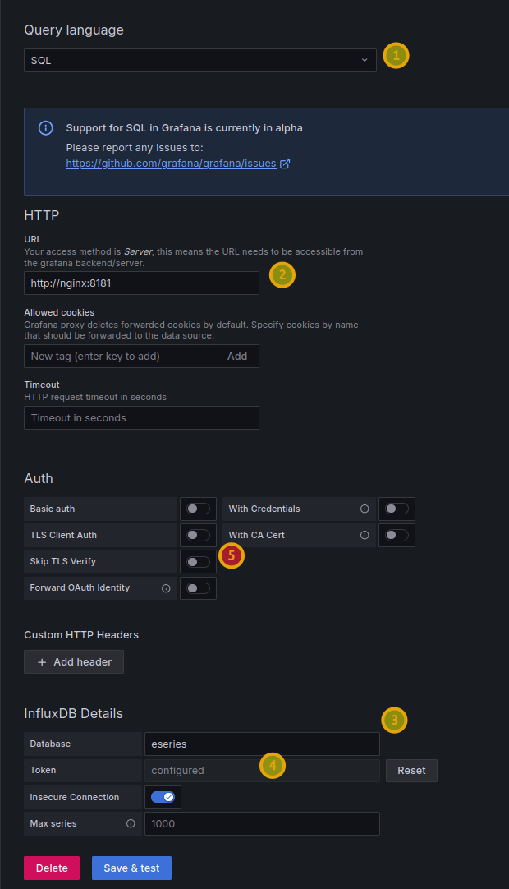

# Documentation for E-Series SANtricity Collector (ESC)

- [Documentation for E-Series SANtricity Collector (ESC)](#documentation-for-e-series-santricity-collector-esc)
  - [Introduction](#introduction)
  - [Architecture](#architecture)
  - [Configuration](#configuration)
    - [Collector's configuration](#collectors-configuration)
      - [TLS certificates](#tls-certificates)
      - [Secrets](#secrets)
      - [Authentication](#authentication)
  - [Containers](#containers)
    - [Utilities (`utils`)](#utilities-utils)
    - [Reverse proxy (`proxy`)](#reverse-proxy-proxy)
    - [InfluxDB (`influxdb`)](#influxdb-influxdb)
    - [InfluxDB Explorer (`explorer`)](#influxdb-explorer-explorer)
    - [S3 (`s3`)](#s3-s3)
    - [Collector (`collector`)](#collector-collector)
    - [Grafana (`grafana`)](#grafana-grafana)
  - [Maintenance](#maintenance)
    - [Containers](#containers-1)
    - [Storage](#storage)
      - [Storage capacity](#storage-capacity)
      - [Storage performance](#storage-performance)
      - [Storage security](#storage-security)
  - [EPA Collector arguments](#epa-collector-arguments)
    - [`api`](#api)
    - [`tlsCA`](#tlsca)
    - [`tlsValidation`](#tlsvalidation)
    - [`systemId`](#systemid)
    - [`output`](#output)
    - [`influxdbUrl`, `influxdbDatabase`, `influxdbToken`](#influxdburl-influxdbdatabase-influxdbtoken)
    - [`prometheus-port`](#prometheus-port)
    - [`intervalTime`](#intervaltime)
    - [`no-events`, `no-environmental`](#no-events-no-environmental)
    - [`log-level` and `logfile`](#log-level-and-logfile)
    - [`maxIterations`](#maxiterations)
    - [Raw collector](#raw-collector)
  - [Security](#security)
  - [Data collection and privacy policy](#data-collection-and-privacy-policy)
  - [Extras](#extras)
    - [Natural Language Processing (NLP)](#natural-language-processing-nlp)
    - [InfluxDB MCP Server for InfluxDB 3 Core](#influxdb-mcp-server-for-influxdb-3-core)
  - [Tips](#tips)
    - [Connecting from external InfluxDB clients](#connecting-from-external-influxdb-clients)
    - [Using `utils` container](#using-utils-container)
    - [SQL](#sql)

## Introduction

ESC is a Python-based metrics, events, and configuration collector for SANtricity storage appliances. It comes in a full stack that includes Collector, InfluxDB 3 and related tools and utilities.

To install and configure in a step-by-step manner, see [GETTING_STARTED](./GETTING_STARTED.md).

## Architecture

Collector has two data flows: Live API and JSON replay. Almost all users will use the former, Live API mode:

- Live API access is performed directly to SANtricity management IPs (controller API).
- Responses are processed based on their types (performance metrics, events, environmental readings, configuration data).
- Data processing and enrichment uses system and object (such as volume) configuration data to enrich API responses by labeling them for easier analysis and access later on.
- Data then flows to the writers of which there are two: InfluxDB 3 and Prometheus. The former writes to InfluxDB while the second just exports data on a built in HTTP server for standard Prometheus scrapers. InfluxDB is the default output, but both or just Prometheus may be used instead. Prometheus does not export configuration details, but other data (metrics, events, environmental readings) are exported.

JSON replay only differs in the first step:

- JSON replay requires an ingress directory with JSON responses and a system ID (i.e. WWN) to ensure it reads files that belong to that, and only that, SANtricity system.

Prometheus data are simply scraped and there isn't much to it. As for InfluxDB, you can use any HTTP client to access it. Some choices provided in the ESC stack:

- InfluxDB Explorer - SQL-centric Web client
- InfluxDB 3 CLI, `curl` and InfluxDB 3 Python module are in the `utils` container, making it possible access InfluxDB securely, quickly and easily
- Grafana - mostly for visualization

Alerts and notifications can be configured either in InfluxDB 3 (using InfluxDB plugins) or Grafana. Collector can also push alerts directly to Grafana, but this hasn't been done yet as it's not clear whether users want to open Grafana to "push" notifications from ESC.

## Configuration

Main configuration-related files are directories:

- TLS certificates: `./certs` CA and TLS certificates and private keys for containerized services
- Environment variables: `.env` (env.example) for services, their software versions, IP addresses and more
- Secrets: `./data/influxdb_tokens` has InfluxDB admin and user token
- Docker services: `docker-compose.yaml` (not needed for CLI users)
- Container entrypoints: `./<container-name>/`

### Collector's configuration

Collector collection details currently aren't configurable beyond what you see in CLI help because it is complex.

There are different categories of data, different sources (live and JSON), different collection schedules, different outputs, data models, etc. 

Because of that, adding, enabling or disabling a metric or changing how something works requires changes in different files in several parts of the collector code and testing of all the permutations. Without readily available storage systems for testing, it's not easy to improve it.

#### TLS certificates

The ESC stack defaults to using internal certificates for service-to-service and client-to-service communications to achieve trustless security in a VM, Docker or Kubernetes namespace, while a reverse proxy can use TLS issued by both internal and external CA to achieve optimal security on LAN and within the stack.

This table may help you better understand TLS-related configuration and interactions:

- Service: shows which container service has a service TLS certificate and key. (`SS` is self-signed with in-Docker internal CA, `Org` is Organization CA-signed)
- Self-signed CA: copy of self-signed CA certificate and TLS certificate for connecting to specific in-Docker service
- Organizational CA: reverse proxy is the only service that would need it in a "bridged" design like this

| Service            | Service cert | Self-Signed CA  | Organizational CA |
|--------------------|:------------:|:---------------:|:--:|
| InfluxDB           | Y (SS)       | CA              | -  |
| InfluxDB Explorer  | Y (SS)       | CA, InfluxDB    | -  |
| Collector          | N (SS)       | CA, InfluxDB, Proxy |  - |
| Proxy              | Y (SS, Org)  | CA              |  CA |
| `utils`            | -            | CA, InfluxDB    |  -  |

We can see from the table that the `utils` container provides no services, so it has no service certificate from any CA, while the `proxy` container has two which allows Collector, as well as any LAN client, to use it. Proxy service is the only service that needs a TLS certificate issued by organizational CA which is recognized by LAN users. If Collector accesses InfluxDB through the proxy, make sure it has access to root CA TLS certificate through the OS, container, or runtime arguments because there's no setting or argument to skip or loosen TLS checking for outgoing connections to InfluxDB.

It is up to you, but because Proxy exposes service to LAN users, even if you generated snake-oil TLS for "in-Docker" services, you could have Proxy use your organization-issued CA for Proxy's TLS services on LAN. But, in order to validate services with snake oil TLS certificates behind it, Proxy would also need to import your self-created CA. If the entire stack uses TLS certificates created by a single CA, then just load that one CA in Proxy.

Once those certificates are ready, services load them through Docker Compose or other method (such as creating a Docker image that includes them). You may inspect `docker-compose.yml` to see how the Docker Compose approach works.

#### Secrets

Depending on what/how you use EPA, you may want to check these files and directories

- `.env` - for Docker Compose users
- `.docker-compose.yml` - also for Docker Compose, especially you hate `.env` files
- `./data/influxdb_tokens/` - bearer tokens for InfluxDB admin and users

If you're concerned about secrets, you don't have to use EPA's approach. Or maybe you aren't allowed to use EPA's approach. In that case, the simplest way is this:

- Run EPA Collector Build own EPA Collector container (see `./collector/Dockerfile` or start from scratch)
  - Optionally modify Collector to load secrets from Vault
- Run all other services and containers any way you want, anywhere you want. Collector just needs to authenticate against SANtricity API endpoints and InfluxDB (preferably using regular TLS validation)

#### Authentication

This is the usual pain point of collectors: strict security requires SAML which results in "Game Over" for collectors that rely on Local users' roles. Read about it ["What are the local users?"](https://docs.netapp.com/us-en/e-series-santricity/um-certificates/faq-user-access-mgmt-um.html#what-are-the-local-users). If your environment enforces SAML on E-Series, then it's "game over" (until EPA adds SAML support).

Assuming no SAML in place, EPA Collector only ever needs read access to SANtricity, so the `monitor` account is perfectly suitable for that: it can read stuff (not passwords), but **you need to enable it** by configuring its password. With this in place, 95% of your security risks are gone.

To write data to InfluxDB, EPA Collector needs a API/bearer token from InfluxDB. InfluxDB has no RBAC, so depending on preference you may or may not want to share InfluxDb among multiple users. This API token can be rotated as necessary, and you can provision one instance of InfluxDB for every instance of EPA Collector so that you have "1 E-Series System, 1 EPA Collector, 1 InfluxDB (and optionally 1 S3 bucket)".

As you add more services to the mix, scenarios can become more complex but you may do your own research or pay someone to figure it out for you.

EPA Collector provides the option of getting prompted to provide authentication for SANtricity and InfluxDB. Simply don't specify either and you'll be prompted on startup. See the Security section for more.

## Containers

This section describes what each container does and the main things to know about it. If you don't like any of this, feel free to change it or submit a pull requests to make it better.

### Utilities (`utils`)

As the name says, the `utils` container is used for easy administrative access to EPA containers. What's special about it is this container is **pre-configured** to access S3 and InfluxDB services. It is *not reachable* from the outside, but anyone who can access this container can access the aforementioned services. If you don't like that idea, you may remove it from `docker-compose.yml`.

The `utils` container comes with:

- InfluxDB 3 client (which is the same binary as InfluxDB 3 server) pre-configured for the `influx` user
- InfluxDB 3 Python module for Python scripts
- `jq`, `curl`, `wget`, `vim`
- AWS S3 CLI

### Reverse proxy (`proxy`)

This container's main purpose is to protect services from ESC stack, such as InfluxDB, InfluxDB Explorer, Collector (when running Prometheus exporter), etc. Even E-Series API services could be proxied by `proxy`:

- Reverse proxy is optional, but highly recommended for security reasons
- EPA "clients" such as S3 Web UI, InfluxDB Explorer, EPA Collector and `utils` could access EPA services through NGINX and some "internal" services are already exposed on NGINX - usually those that have separate authentication (InfluxDB, for example). To disable those, edit `nginx.conf` and `proxy` service in Docker Compose. To add new services, expand or modify existing configuration and restart `proxy` service
- `proxy` can also serve as authentication gateway and firewall (to limit access to certain external (visitor) IPs), for which you'd also have to enable that in `nginx.conf`

`proxy` keeps its vHost and TLS configuration in `nginx.conf` file. For example, client-facing TLS certificate may come from an enterprise CA, while Docker-internal CA may be required if upstream hosts use Docker-internal CA and TLS - then `proxy` needs Docker-internal CA to validate upstream services' TLS certificates.

The proxy logs to `./data/nginx/logs/` on the host.

### InfluxDB (`influxdb`)

InfluxDB 3 runs on port 8181 using **HTTPS**. There's no HTTP option. Proxy can expose that service to LAN users on port 18181, but in order to access InfluxDB services you need an admin-issued token, so having the port exposed doesn't mean anyone can query or write to InfluxDB.

The `/health` endpoint on InfluxDB may not require authentication to make it possible to monitor DB service from outside of your Docker Compose environment. 

InfluxDB has no "administrator password" that can be recovered (although since InfluxDB 3.3 there's a way to recover it through the console, it is not trivial), so backup your `./data/influxdb_tokens/admin.token` to be able to easily regain admin access to InfluxDB if you lose the original.

Regarding ESC's database name: EPA v4 defaults to `epa`. Metrics are tagged with SANtricity system WWN and system name, so you can store metrics from multiple arrays in the same database. If you need more isolation you can create multiple databases (in addition to, or instead of, `epa`) and specify a different DB name in each Collector instance. 

To issue new API tokens and delete existing, use InfluxDB Explorer (Web UI) or the `utils` container (CLI).

InfluxDB stores its data in `./data/influxdb`. It has no backup utility, so cold backup is the main alternative: stop `influxdb` (and `collector` before that if you want) and make a copy of data directory.

### InfluxDB Explorer (`explorer`)

If InfluxDB and InfluxExplorer run within same Docker Compose instance, you would connect to InfluxDB using HTTPS, its Docker name and port: `https://influxdb:8181`.

InfluxDB Explorer has no account support or built-in authentication of its own. Every user needs own API token. Once you configure it to access InfluxDB, anyone who accesses this container can access configured databases as well. Explorer is exposed through Proxy (if running), which may be risky. What to do? Some options:

- remove `explorer` from Docker Compose
- remove `explorer` from Docker Compose, then deploy a Docker Compose with *only* `influxdb3-ui` in a separate environment and access InfluxDB service at using `proxy`-proxied InfluxDB endpoint on the first Docker Compose instance (https://proxy.co.org:18181, for example)
- remove `explorer` from Docker Compose and install `explorer` locally
- remove `explorer` from Docker Compose and use CLI or Grafana to access InfluxDB via Proxy
- change `nginx.conf` to configure authentication for InfluxDB Explorer service and/or limit access by client IP/FQDN
- change `nginx.conf` to not expose InfluxDB to LAN users or disable/remove this service from Docker Compose

If you're concerned about unauthorized access to InfluxDB from LAN, remove this service from Docker Compose or disable it on Proxy.

InfluxDB Explorer comes with no initial configuration at start, so nothing is configured and valid InfluxDB API token is required for configuration.

If you want to use it it's safest to deploy it on your client or use some secure environment that can reach `influxdb` through that `proxy` (unless you have alternative ways to connect to `influxdb`).

Note that InfluxDB Explorer saves password on a (persistent) Docker volume required to avoid re-configuration after container start. Credentials are not stored as plain text, but they're on disk. Check their documentation for more information about that and service security.

### S3 (`s3`)

**NOTE:** ESC with InfluxDB and S3 back-end works fine, but objectively no one with less than 20 arrays needs it and I've removed it from "core" services to decrease complexity. If you need to tier to S3, create a Github issue if you want Versity S3 Gateway added back.

### Collector (`collector`)

Collector accesses SANtricity API at the IP address of FQDN provided with `--api`. For dual controller systems you can provide two controllers, but one works fine as well. 

You shouldn't use one Collector instance with multiple E-Series systems, as in `--api ef600c1 e4012c1`. Even if the credentials were the same, this won't work well (or at all) because Collector assumes the same SANtricity system. If you have two systems, create two Controller instances (i.e. rename Controller service from `collector` to `epa-ef600` and add another as `epa-e4000`).

Collector's default workflow is stateless, `--fromJson` are provided, it reads data from specified directory.

Regarding TLS certificates on E-Series controller(s), Collector will by default validate. The recommended approach is to create a CA for the ESC stack and deploy those certificates to E-Series controllers as well and Collector will handle that because it has a copy of CA certificate that was used to issue those. But, if SANtricity management servers use organization's CA, you may need to specify it with `--tlsCa` (container) or ad it to OS trust store.

### Grafana (`grafana`)

Grafana is provided for initial tire-kicking, but users are expected to have own Grafana that monitors their infrastructure and not an "ESC Grafana".

The extent of Grafana integration is as follows:

- Grafana container version 12.2 is included (version is set in `.env` and override is possible cverride is possible in  Docker Compose)
- TLS v1.3 in place by default and Grafana is made aware of in-Docker CA (to be able to validate InfluxDB's TLS certificate)
- Proxy is configured to proxy external access to Grafana in Docker (see the proxy-related script in `./scripts/`, and `.env` and `docker-compose.yml` for the variables)
- Grafana is set to be created using the default Grafana credentials, so change them in `.env` before provisining or in the UI before you expose Grafana on LAN

It recommended to delete this service from `docker-compose.yml` and use your own Grafana server.

How to set up Grafana's Data Source with InfluxDB 3:

)

- Point (1): while you can use `InfluxQL` (InfluxDB 3 supports it), it is recommended to use `SQL` as Grafana Data SOurce query language since that is the new InfluxDB default
- Point (2): if both Grafana and InfluxDB inside of same Docker Compose environment, InfluxDB will be at `https://influxdb:8181`. Otherwise use the included reverse proxy in front of your InfluxDB server (`https://proxy:18181` here just as an example. It could also be your proxy service's FQDN and port such as `https://proxy.intranet.internal:18181`).
- Point (3): ESC defaults to using the database name `epa`. Adjust if you picked another in `.epa` or Collector's CLI arguments.
- Point (4): this is the place where you can paste your InfluxDB API Token
- Point (5): we want to use our CA certificate and validate and *not* Skip TLS Verify, but pre-12.2 Grafana has a [bug](https://github.com/grafana/grafana/pull/105586) that has been fixed in 12.2. It is recommended to not disable TLS Verify and Grafana configuration included in ESC is 12.2, so given this fixed version and Grafana's awareness of CA TLS certificate used to issue InfluxDB's TLS certificate, this isn't necessary.

## Maintenance

### Containers

To rebuild containers after code changes (example for all containers):

```bash
docker compose build
docker compose up -d
```

To update containers:

```bash
docker compose down <dockerServiceName>
# change docker-compose.yaml 
docker compose build <dockerServiceName>
# if OK, start as usual
```

To regenerate a TLS certificates for a service, stop service and re-run the Python script in `./certs/_master/` using the argument for the service that you want to "refresh". You may need to remove or rename existing certificates in order to generate new ones in their place.

```bash
rm -rf certs/<service>/<particular-certificate>
```

To generate a new InfluxDB admin token, you have two choices:

- Recommended: use the `influxdb` or `utils` container to reset its credentials on HTTPS port 8182. This "recovery" service port is not exposed externally on `influxdb` and therefore not accessible from LAN or via Proxy
- You can also remove existing tokens, then `down` and `up` your `influxdb` service. That should regenerate the tokens
- If tokens are regenerated, all containers, applications and clients that use them need to be restarted (Collector will re-read on-disk token), rebuilt or manually updated (Collector if you changed it to load secrets from a vault, or in some other service where you pasted manually pasted API token, such as when we configure Grafana Data Source)

To rotate services' passwords or API keys:

- you may change them in the application and then, if necessary, in configuration files (or vault) as well
- if you create a new InfluxDB key for some non-essential (e.g. `utils`, `explorer`) or your own clients, you don't need to touch any container configuration, but you need to update client-side (InfluxDB Explorer) settings or rebuild the container (since `utils` has the self-signed CA certificate built in)

### Storage

EPA Collector has no persistent storage unless these two very specific scenarios:

- Collector mode: to gather API responses from Live API system, you'll need to mount a Docker volume and use `./collector/raw_collector_cli.py` with in-container path to "out" volume to save those responses. This will take approximately 0.5 MB per minute. You can limit iterations or space them out to more than the default 60s interval to save space.
- JSON replay mode: to "replay", you need to copy those files to an "in" directory in same or different Collector, and use `--fromJson <ingress-directory>` as well as provide system ID (WWN) of the source system to enable file pattern matching. With output to InfluxDB (default) this will consume InfluxDB storage as Live API mode would (no difference). If you have more than one iteration gathered, you can replay all with `MAX_ITERATIONS: 0` in Docker Compose, or fewer by setting that to a low positive integer such as `1` or `2`
- Debug mode: in any mode, if log level `DEBUG` is enabled, and log file location points to a writable volume such as your "out" volume, Collector will write its debug log to that file, and InfluxDB and Prometheus (whichever is enabled) will also dump two debug output for the first and last iteration. If `MAX_ITERATIONS` is `1` that will be just one file per output, if `2` or more then no more than `2`. Because of this, you may get at most 2-3 MB from Collector log per each iteration and for outputs just 2-3 MB per output.

#### Storage capacity

It appears that at the usual rate of one iteration per minute, InfluxDB grows by approximately 100 KB per iteration.

To evaluate your requirements you may run Collector for 60 or 1440 iterations and estimate monthly requirements.

InfluxDB plugins may be used to down-sample or prune old data.

#### Storage performance

InfluxDB 3.5 has configurable cache settings, and query-heavy Grafana users can tune InfluxDB to cache specific tables (measurements) in memory.

#### Storage security

General recommendations:

- If you think your EPA stores confidential data, don't share the same DB instance and don't share the same EPA or Docker Compose instance
- The same EPA instance allows users with valid keys to view databases from other users
- The same Compose instance allows the user who can start `utils` container also access other containers
- All container's data is in `./data/` sub-directory and accessible to any VM `sudo`er. This includes DB access tokens in `./data/influxdb_tokens/` and TLS keys in `./certs/influxdb`, for example

A simple way to split EPA among several VMs with LUKS disks is to generate valid TLS certificates, copy EPA repository to several VMs and simply enable selected containers on selected VMs. That way you get different VM admins, networks, disks and because TLS certificates are valid, secure reverse HTTPS proxy makes it easy to put it all together.

EPA containers could run as non-root user, but it would require Docker CE with rootless support and still wouldn't enable meaningful isolation and data confidentiality.

## EPA Collector arguments

Below you will find some details about EPA Collector arguments and switches you should know about.

```sh
$ python3 -m collector -h
usage: __main__.py [-h] (--api API [API ...] | --fromJson FROMJSON) [--username USERNAME] [--password PASSWORD]
    [--tlsCa TLSCA] [--tlsValidation {strict,normal,none}] [--systemId SYSTEMID]
    [--output {influxdb,prometheus,both}] [--influxdbUrl INFLUXDBURL] [--influxdbDatabase INFLUXDBDATABASE] 
    [--influxdbToken INFLUXDBTOKEN] [--prometheus-port PROMETHEUS_PORT] [--intervalTime INTERVALTIME]
    [--no-events] [--no-environmental] [--log-level {DEBUG,INFO,WARNING,ERROR}] [--logfile LOGFILE] [--maxIterations MAXITERATIONS]
```

### `api`

SANtricity management IPs (as well as `username` and `password`) are required for Live API mode.

For systems with two (functioning) controllers, you may provide both (`--api 1.2.3.4 5.6.7.8`) or just one.

When Collector starts and two controllers are specified, it picks a random controller. If one of the controllers isn't usable it will try the other and stay on it. At least one must work, obviously, otherwise we exit since nothing can get collected anyway.

### `tlsCA`

CA certificate that issued InfluxDB's TLS certificate.

ECS Collector goes out of its way to reject weak TLS certificates. It must trust the CA and this is where its' done. Or you can have the OS trust the CA (although in a container environment, that won't be enough).

### `tlsValidation`

Default is `normal`, which means no snake oil TLS.

Of course, if that doesn't work no one tries to create stronger certificates - they try `none` to see if that works. It does. But it won't work for InfluxDB where `strict` is is the only mode.

### `systemId`

Live API mode doesn't require this, so you can ignore it, but JSON replay does, and it must match JSON files that are being ingested.

For JSON replay, `systemId` (`SYSTEM_ID` in `docker-compose.yml`) is required and must match your files.

### `output`

Default: `influxdb`, which means all the `--influxdb*` arguments or environmental variables need to be set when InfluxDB is included. `both` is the same as far as DB connection details are concerned, but it also enables Prometheus Exporter. Only `prometheus` doesn't require any DB connection details.

If you use `--output=prometheus`, you may need to expose the prometheus port on container service or host if you need to access it from the outside. It is recommended to modify the `proxy` container to enable proxying of Collector's Prometheus the same way it's done for InfluxDB, rather than exposing Collector to the outside. For example, if Collector exposes Prometheus on HTTP port 8000, Proxy can proxy HTTPS on port 58443 to Docker's HTTP service on port 8000.

Note that Prometheus does not export any *configuration* details, which is by design. If you need to keep or access configuration details, it is suggested to forward SANtricity logs to a SIEM system.

### `influxdbUrl`, `influxdbDatabase`, `influxdbToken`

- `influxdbUrl` example: `https://influxdb:8181` (inside of Docker Compose)
- `influxdbDatabase` example: `epa`
- `influxdbToken` example: `Api...l.o.n.g...s.t.r.i.n.g` obtained from InfluxDB CLI, API or Explorer UI

### `prometheus-port`

You probably never need to set it:

- Prometheus exporter is disabled by default
- If you enable Prometheus with `--output`, it is still recommended to use the default port and not expose it to the outside world. Use the proxy service and make Prometheus externally available over TLS

### `intervalTime`

Interval between collection cycles. Default: 60 (seconds).

It usually takes less than 10s to complete collection, so there's no reason to set it to more to 120 or 180 seconds, but you can do that (in order to save disk space, for example).

Note that not everything is saved in every cycle (iteration): performance, events and environmentals are saved in every iteration, while configuration data is saved to disk in multiples of this base interval, so some config measurement that's saved to disk once an hour with a 60s interval will be saved once every two hours with a 120s interval time. If even 180s presents disk space problems, create downsampling or pruning policies usin InfluxDB plugins (or open a Github issue if you need help).

### `no-events`, `no-environmental`

If you want to save a bit of disk space, you can use these switches to disable event and/or environmental data collection. But these barely consume any disk capacity, so it is suggested to not use them.

If events aren't collected, you will also not store any system failures in InfluxDB.

### `log-level` and `logfile`

To enable debugging, use `--log-level DEBUG` (`COLLECTOR_LOG_LEVEL: DEBUG` in `docker-compose.yml`). Additionally, provide the full path to collector log file (Docker variable `COLLECTOR_LOG_FILE`). 

Collector will save log to that file, strip the file name and use the same path to also store InfluxDB or Prometheus log(s) if these are enabled. Logs may add 2-3 MB/min so use `--maxIterations` (`MAX_ITERATIONS`) to limit this if your capacity isn't large.

### `maxIterations`

The maximum number of Collector iterations to run.

Normally we don't set this to anything and it defaults to `0` which means forever.

Sometimes `--maxIterations 1` is a good way to start, and sometimes `11` or `61` is more suitable for testing.

If you use Collector as a long-running service, don't use this argument. Also note - it's noted in docker-compose.yml as well - that Docker Compose will restart Collector unless it's set to `"no"` (do not restart), so pay attention to that vs. `"unless-stopped"` when setting `MAX_ITERATIONS` to positive integer values.

### Raw collector

"Raw" (as opposed to processed or enriched) JSON collector gathers raw responses from SANtricity endpoints, wraps that in `resp['data']`, adds some "metadata" and saves that object to a file with specific pattern such as `<type>_<measurement>_<system_id>_<timestamp>.json`. Example: `env_power_600A098000F637140000000011111111_202509291806.json`:

```json
{
  "system_id": "600A098000F637140000000011111111",
  "timestamp": "202509291806",
  "endpoint": "env_power",
  "measurement_name": "env_power",
  "data": {
    "returnCode": "ok",
    "energyStarData": {
      "totalPower": 400,
      "numberOfTrays": 1,
      "trayPower": [
        {
          "trayID": 0,
          "numberOfPowerSupplies": 1,
          "inputPower": [
            400
          ]
        }
      ]
    }
  }
}
```

You may limit its interval and the number of iterations. Sometimes you may run it for one or two iterations, other times hundreds or thousands (assuming you have enough disk space).

Those JSON files can then be ingested by copying or moving them to a host path that doubles as Collector volume and running Collector with `--fromJson /in/docker/path/to/files/ --systemId 600A098000F637140000000011111111` to igest files from that system.

Use `python3 collector/raw_collector_cli.py -h` to find out more. Alternatively, `python3 -m collector.raw_collector_cli -h`.

## Security

EPA aims for "security out of the box" and provides sane default sand sufficient information to make good security available on Day 1.

We use end-to-end HTTPS for everything, default TLS version is v1.3 with strong ciphers and TLS certificate validation enabled by default. Advanced users can use existing setup to further enhance HTTPS with strict TLS validation and Post-Quantum ciphers on external gateway.

E-Series SANtricity suggests to use the basic "monitor" account for tasks like Collector's. Even if these credentials leak or get stolen, they can result only in limited damage (exposure of SANtricity hardware configuration, for example).

If you can't be bothered with "vaults" and aren't allowed to store password on disk either, you may choose to start EPA Collector manually:

- CLI: don't specify `--password` to get prompted to enter one 
- Docker: add `tty: true` to `docker-compose.yml` Collector service and you'll be able to see the password prompt as well

The only main disadvantage is you have to manually restart it if it stops or crashes. How to know when/if it's not running? You'll see no new data in Grafana, so you'll find out pretty quickly. You can also configure alerts in InfluxDB (when no new data for 10 minutes, for example) or Grafana (also on a variety of conditions).

The same prompting works for InfluxDB Bearer Token. It too can live only in your password manager.

Users' API tokens aren't limited to just their databases, but it frees them from filtering by system ID or name, and it's easier to drop individual users' databases when they no longer need them. 

EPA Collector can log to file. We aim to not log user's credentials or InfluxDB API toke to console or files, but you can check the source code or run EPA in debug mode with logging to file enabled for a few days and see if you can find anything that shouldn't be in the logs.

Docker Compose networks aren't segregated because it doesn't have meaningful contribution to security. If you want to segregate services, split EPA services across different VMs (or Nomad nodes) or deploy them to different Kubernetes namespaces.

## Data collection and privacy policy 

EPA only ever connects to SANtricity and InfluxD. It doesn't collect any user data (except for obvious purpose), connect to the Internet or "phone home".

Some 3rd party services (e.g. Grafana, InfluxDB Explorer, etc) may collect "anonymous" statistics, although we try to disble that. 

EPA doesn't go out of its way to identify and disable that and since those aren't essential EPA services it's also not in EPA's scope. You may choose to review those services make whatever configuration changes you want. Having said that, InfluxDB's "anonymous reporting"  has been disabled.

## Extras

### Natural Language Processing (NLP) 

It's an InfluxDB Explorer feature, so you can read about it in upstream documentation

But one thing worth highlighting is the NLP feature not only can help with SQL, but also with Grafana dashboards.

- Configure your AI 
- Query with NLP
- Export SQL query to Grafana, where you can use Grafana's suggestions for visualization based on SQL query

This should work even better if InfluxDB 3 has access to more than just Collector's database, but other client data as well. You may register additional databases in InfluxDB Explorer to achieve that.

### InfluxDB MCP Server for InfluxDB 3 Core

It is easy to add, but the challenge is there are four ways to do it which makes it unlikely that the average EPA user would be able to use any offered example out-of-box. 

See the choices [here](https://github.com/influxdata/influxdb3_mcp_server?tab=readme-ov-file#c-docker) and pick one.

Although InfluxDB MCP is included for exploratory integration, it is best to deploy it on clients and use reverse HTTPS proxy to securely connect to InfluxDB. Just connect to the `utils` container create a token for DB access by MCP server.

## Tips

### Connecting from external InfluxDB clients

Scenario:

- ESC proxy in front of InfluxDB at https://dt.datafabric.lan:18181
- Client needs to be aware of org CA, so I must use `--tls-ca`

```sh
 ~/bin/influxdb3-core-3.5.0/influxdb3 query --tls-ca ~/.certs/root_ca.crt \
   -H https://dt.datafabric.lan:18181 --token `cat /home/.influxdb_tokens/admin.token` \
   --language influxql --database epa "SHOW MEASUREMENTS"
```

### Using `utils` container

### SQL

```sql
-- Easy filtering and grouping
SELECT * FROM config_storage_pools WHERE blk_size_supported = '4096'
SELECT * FROM config_storage_pools WHERE blk_size_supported = '512,4096'

-- Great for capacity planning queries
SELECT pool_name, free_space, used_space 
FROM config_storage_pools 
WHERE blk_size_supported LIKE '%4096%' 
  AND free_space > 1000000000

-- Find all RAID 6 volumes presented (mapped) to hosts
SELECT * FROM config_volumes WHERE raid_level='raid6' AND volume_use='standardVolume' AND mapped='true'

-- Find not standard volumes or unmapped volumes
SELECT * FROM config_volumes WHERE volume_use!='standardVolume' OR mapped='false'

-- Find volumes that have Flash Cache enabled and are in optimal status
SELECT * FROM config_volumes WHERE flash_cached='true' AND status='optimal'

-- Complicated workaround to overcome lack of consistent volume group ID and name mapping across measurements
SELECT d.* FROM config_drives d 
JOIN config_storage_pools p ON d.currentVolumeGroupRef = p.volumeGroupRef 
WHERE p.name = 'sean_raid0'
```
